# Dvorak-Qwerty Layout for the ErgoDox EZ Keyboard

### [Download the firmware](https://github.com/stephenostermiller/qmk_userspace/releases/download/latest/ergodox_ez_base_dvorak_qwerty.hex)

## Features

### Dvorak-Qwerty

Dvorak layout for faster and more accurate typing. Switches to Qwerty layout when ctrl, meta, or alt are pressed so that cut, copy, and paste are easier to use.

### Space Cadet

Extended space cadet functionality where tapping the shift, ctrl, meta, and alt keys type paired symbols on the lift and right hands. Holding the key causes it to work as a modifier like usual.

### Auto shift

Holding keys types the shifted version of that key.

### Tap Dance

Many key have dual functions and produce different results when tapped, held, double tapped, or even triple tapped.

### Unicode and Emojis

Several keys type unicode symbols. How unicode characters are sent is auto-configured based on the OS of the computer into which the keyboard is plugged.

### Indicator Lights

During keyboard boot, the lights flash blue, green and red in turn.

When the keyboard detects it is connected to a new computer, the lights flash to indicate the detected computer OS:

- Green: Linux
- Red: Mac
- Red and Green: Windows

At other times the lights indicate the layout:

- No lights: Dvorak
- Green light: Qwerty
- Red light: Number keypad
- Blue light: CAPS lock, CAPS word, or arrow lock

### Media keys

Easy access to media keys in the main layout

## Layouts

### Dvorak

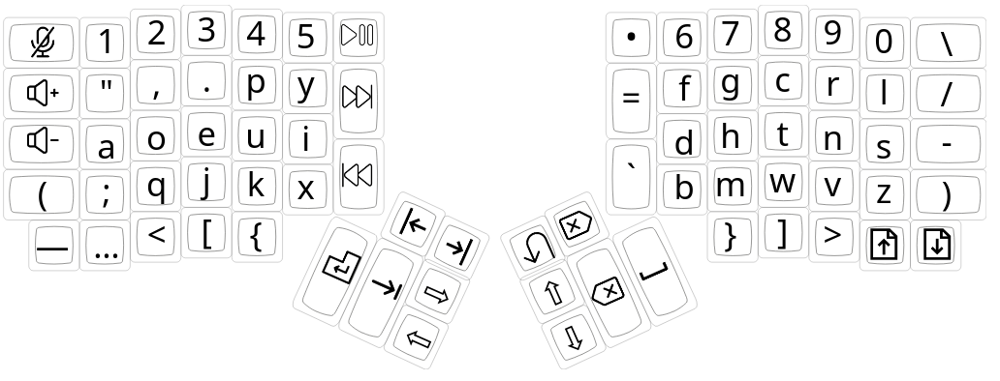

### Dvorak (Hold Key)

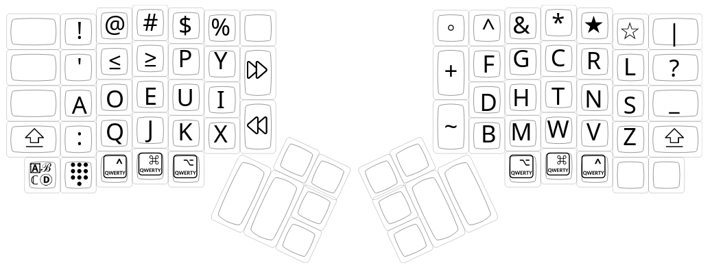

### Dvorak (Shift)

### Dvorak (Double Tap Key)

### Dvorak (Double Hold Key)

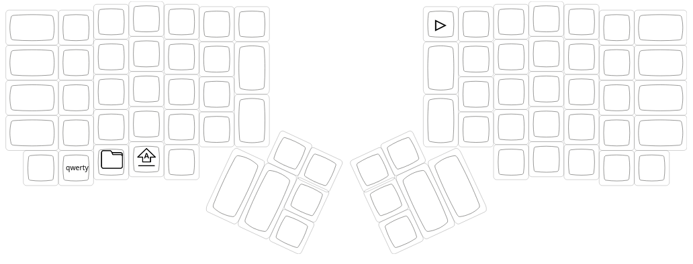

### Dvorak (Triple Tap Key)

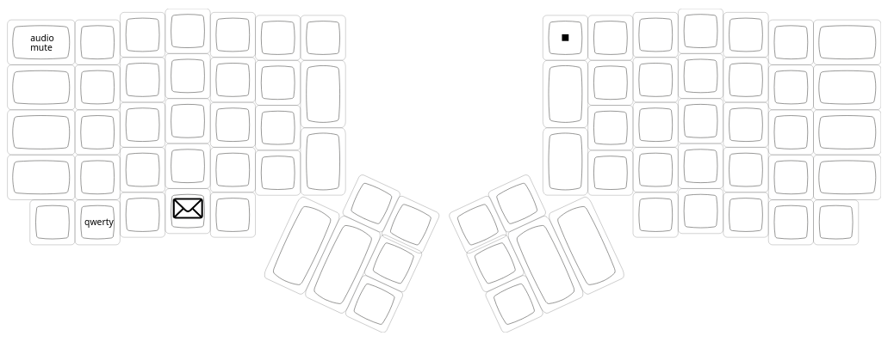

### Dvorak (Triple Hold Key)

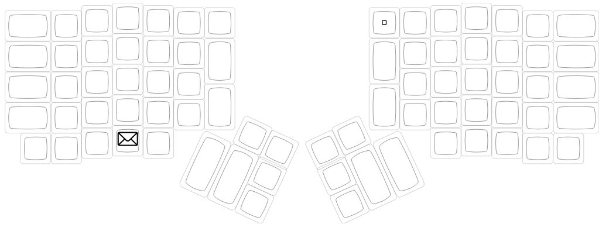

### Number Keypad

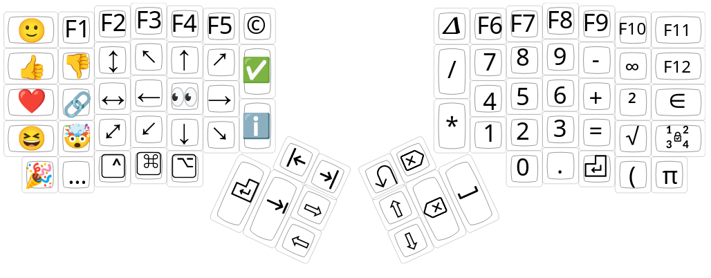

### Number Keypad (Hold Key)

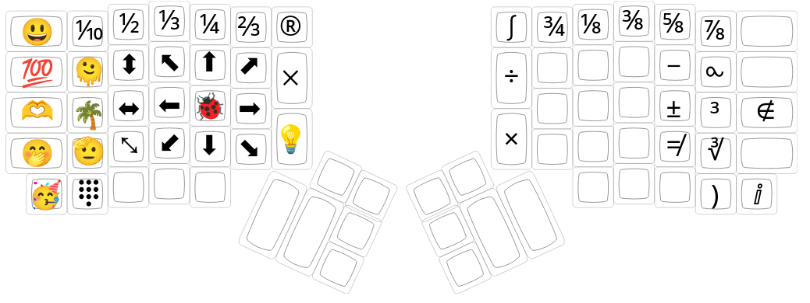

### Number Keypad (Double Tap Key)

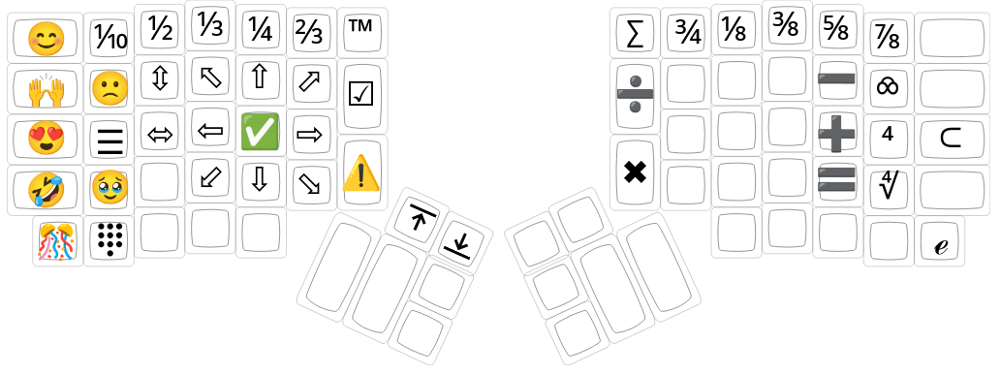

### Number Keypad (Double Hold Key)

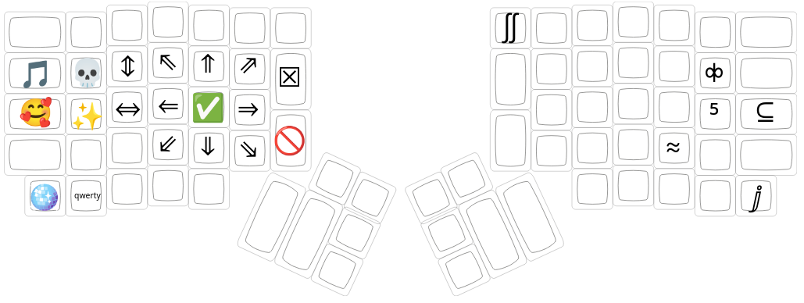

### Number Keypad (Triple Tap Key)

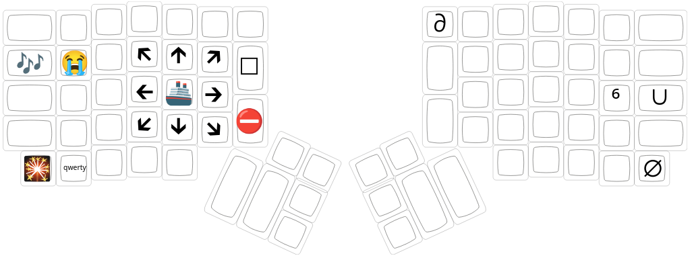

### Number Keypad (Triple Hold Key)

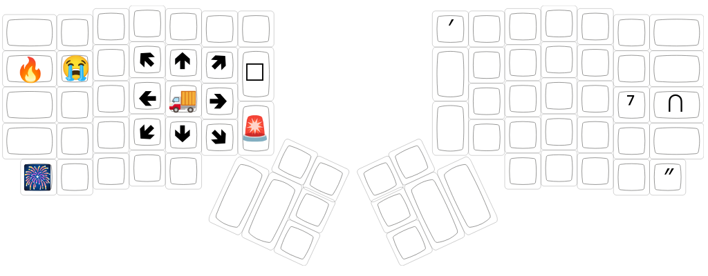

### Qwerty

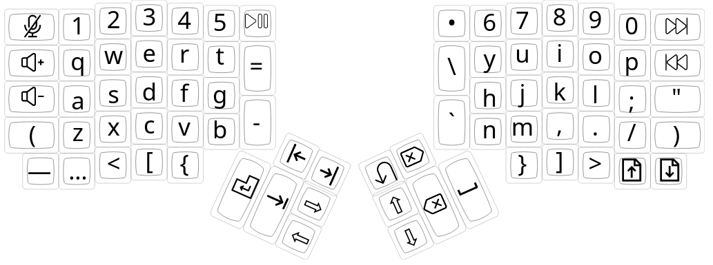

## Icon credits

- <a href="https://www.flaticon.com/free-icons/video" title="video icons">Video icons created by Freepik - Flaticon</a>
- <a href="https://www.flaticon.com/free-icons/email" title="email icons">Email icons created by Freepik - Flaticon</a>
- <a href="https://www.flaticon.com/free-icons/folder" title="folder icons">Folder icons created by Gajah Mada - Flaticon</a>
- <a href="https://www.flaticon.com/free-icons/pause-play" title="pause play icons">Pause play icons created by Shahid-Mehmood - Flaticon</a>
- <a href="https://www.flaticon.com/free-icons/backspace" title="backspace icons">Backspace icons created by Bharat Icons - Flaticon</a>
- <a href="https://www.flaticon.com/free-icons/calculator" title="calculator icons">Calculator icons created by Pixel perfect - Flaticon</a>
- <a href="https://www.flaticon.com/free-icons/cam" title="cam icons">Cam icons created by Icon Mela - Flaticon</a>
- <a href="https://www.flaticon.com/free-icons/enter" title="enter icons">Enter icons created by Lizel Arina - Flaticon</a>
- <a href="https://www.flaticon.com/free-icons/fast-forward" title="fast forward icons">Fast forward icons created by nawicon - Flaticon</a>
- <a href="https://www.flaticon.com/free-icons/rewind" title="rewind icons">Rewind icons created by nawicon - Flaticon</a>
- <a href="https://www.flaticon.com/free-icons/previous" title="previous icons">Previous icons created by Ralf Schmitzer - Flaticon</a>
- <a href="https://www.flaticon.com/free-icons/keypad" title="keypad icons">Keypad icons created by Google - Flaticon</a>
- <a href="https://www.flaticon.com/free-icons/mute-button" title="mute button icons">Mute button icons created by ZAK - Flaticon</a>
- <a href="https://www.flaticon.com/free-icons/volume-up" title="volume up icons">Volume up icons created by Mayor Icons - Flaticon</a>
- <a href="https://www.flaticon.com/free-icons/volume-down" title="volume down icons">Volume down icons created by Mayor Icons - Flaticon</a>
- <a href="https://www.flaticon.com/free-icons/up" title="up icons">Up icons created by Roundicons Premium - Flaticon</a>
- <a href="https://www.flaticon.com/free-icons/screenshot" title="screenshot icons">Screenshot icons created by Freepik - Flaticon</a>
- <a href="https://www.flaticon.com/free-icons/shift" title="shift icons">Shift icons created by Graphics Plazza - Flaticon</a>
- <a href="https://www.flaticon.com/free-icons/ui" title="ui icons">Ui icons created by Bharat Icons - Flaticon</a>
- <a href="https://www.flaticon.com/free-icons/next" title="next icons">Next icons created by Radhe Icon - Flaticon</a>
- <a href="https://www.flaticon.com/free-icons/intranet" title="intranet icons">Intranet icons created by Freepik - Flaticon</a>
- <a href="https://www.flaticon.com/free-icons/close" title="close icons">Close icons created by Bharat Icons - Flaticon</a>
- <a href="https://www.flaticon.com/free-icons/full-screen" title="full screen icons">Full screen icons created by itim2101 - Flaticon</a>
- <a href="https://www.flaticon.com/free-icons/ui" title="ui icons">Ui icons created by Mike Zuidgeest - Flaticon</a>
- <a href="https://www.flaticon.com/free-icons/go-to-the-top" title="go to the top icons">Go to the top icons created by Cap Cool - Flaticon</a>
- <a href="https://www.flaticon.com/free-icons/capslock" title="capslock icons">Capslock icons created by Roundicons Premium - Flaticon</a>
- <a href="https://www.flaticon.com/free-icons/insert" title="insert icons">Insert icons created by Rahul Kaklotar - Flaticon</a>
- <a href="https://www.flaticon.com/free-icons/lock" title="lock icons">Lock icons created by Freepik - Flaticon</a>
- <a href="https://www.flaticon.com/free-icons/alt" title="alt icons">Alt icons created by Rahul Kaklotar - Flaticon</a>
- <a href="https://www.flaticon.com/free-icons/command" title="command icons">Command icons created by Smashicons - Flaticon</a>
