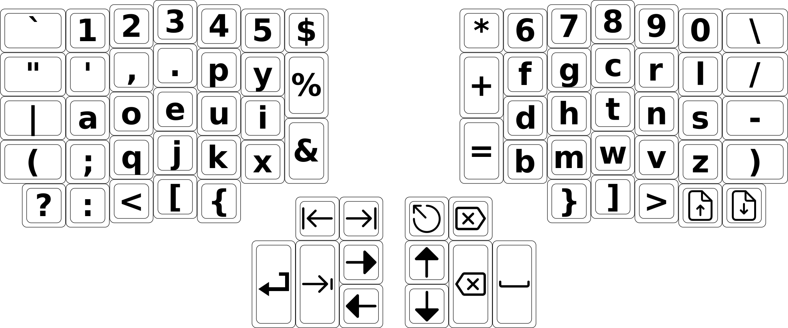
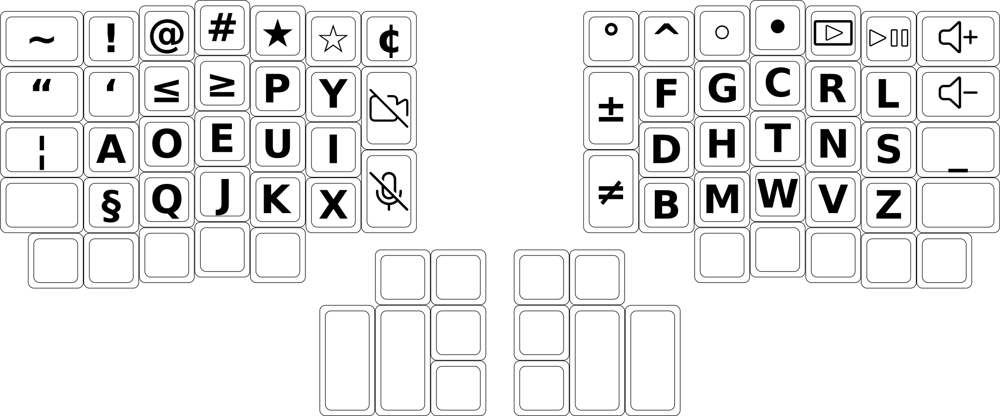
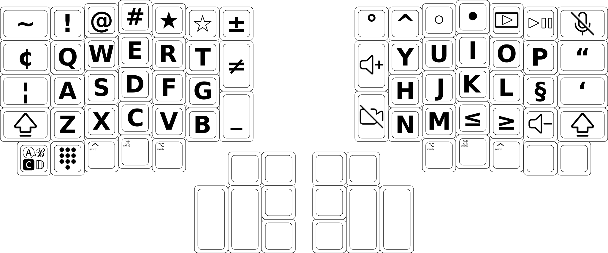
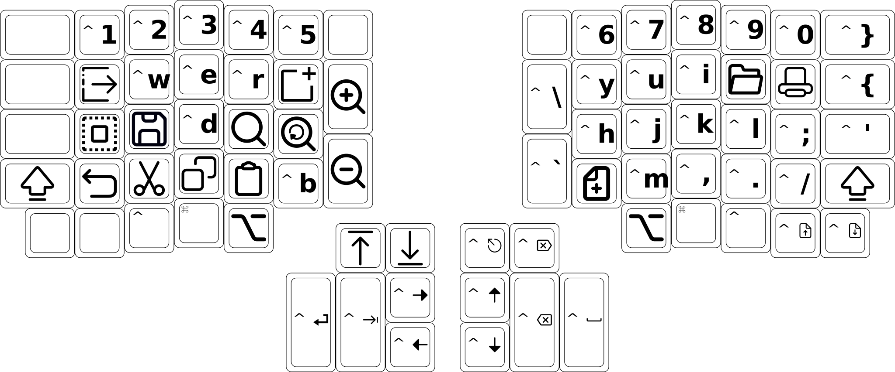
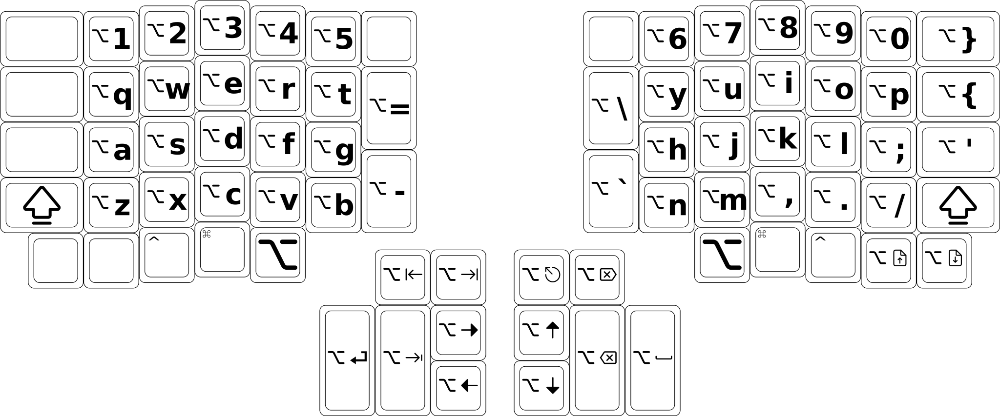

# Dvorak-Qwerty Layout for the ErgoDox EZ Keyboard

### [Download the firmware](https://github.com/stephenostermiller/qmk_userspace/releases/download/latest/ergodox_ez_base_dvorak_qwerty.hex)

## Layout Features

### Dvorak-Qwerty

Dvorak layout for faster and more accurate typing. Switches to Qwerty layout when ctrl, meta, or alt are pressed so that cut, copy, and paste are easier to use.

### Symbol Promotion

Most symbols that would normally require the shift key have been moved to standalone keys. On this layout, shift produces less common symbols that are not available on standard keyboards.

### Space Cadet

Modifier keys produce symbols when tapped. The symbols are mirrored between the right and left hands.

### Auto shift

Holding keys types the shifted version of that key.

### Tap Dance

Dual function keys that produce different results when tapped, held, double tapped, or even triple tapped.

### Media keys

Easy access to media keys in the main layout

### Unicode and Emojis

Many unusual symbols and emoji can be typed. They keyboard automatically configures itself to type unicode characters in a way that is compatible with the operating system of the computer into which it is plugged.

### Indicator Lights

During keyboard boot, the lights flash blue, green and red in turn.

Just after boot and other times when the keyboard detects it is connected to a new computer, the lights flash to indicate the detected computer OS:

- Green: Linux
- Red: Mac
- Red and Green: Windows

Otherwise the lights indicate the layout:

- No lights: Dvorak
- Solid green light: Qwerty
- Solid red light: Number keypad
- Flashing green and red lights alternately: Fancy alphabet
- Solid blue light: Arrow lock
- Quickly flashing blue light: CAPS word
- Slowly flashing blue light: CAPS lock

## Layers

### Dvorak

### Dvorak (Hold)

### Dvorak (Shift)

### Dvorak (Double Tap)

### Dvorak (Double Hold)

### Dvorak (Triple Tap)

### Dvorak (Triple Hold)

### Num Fn

### Num Fn (Hold)

### Num Fn (Double Tap)

### Num Fn (Double Hold)

### Num Fn (Triple Tap)

### Num Fn (Triple Hold)

### Qwerty

### Qwerty (Hold)

### Qwerty (Shift)

### Qwerty (Double Tap)

### Qwerty (Double Hold)

### Qwerty (Triple Tap)

### Qwerty (Triple Hold)

### Qwerty Control

### Qwerty Control (Hold)

### Qwerty Control (Shift)

### Qwerty Meta

### Qwerty Meta (Hold)

### Qwerty Meta (Shift)

### Qwerty Alt

### Qwerty Alt (Hold)

### Qwerty Alt (Shift)

### Fancy

## Key Cap Labels

These images are sized appropriately to print at 100% scale.

- Use with [Relegendable DSA-Style Keycaps](https://www.amazon.com/dp/B0DH8M71D6).
- Print on sticker paper and attach to the front side of your keycaps.

### For black key caps

### For white key caps

## Icons

###  Shift
License: MIT License, Author: Microsoft

###  Auto Shift
License: MIT License, Authors: Stephen Ostermiller, Microsoft

###  Caps Lock
License: MIT License, Authors: Stephen Ostermiller, Microsoft

###  Caps Word
License: MIT License, Authors: Stephen Ostermiller, Microsoft

###  Enter
License: MIT License, Author: Elusiveicons

###  Space
License: MIT License, Author: Microsoft

###  Tab
License: MIT License, Authors: Stephen Ostermiller, Microsoft

###  Backspace
License: MIT License, Author: Ionicons

###  Delete
License: MIT License, Authors: Stephen Ostermiller, Ionicons

###  Up
License: CC Attribution License, Author: Solar Icons

###  Down
License: CC Attribution License, Author: Solar Icons

###  Left
License: CC Attribution License, Author: Solar Icons

###  Right
License: CC Attribution License, Author: Solar Icons

###  Control
License: Public domain

###  Control Qwerty
License: Public domain

###  Meta
License: Public domain

###  Meta Qwerty
License: Public domain

###  Alt
License: Public domain

###  Alt Qwerty
License: Public domain

###  Escape
License: CC Attribution License, Author: Solar Icons

###  End
License: MIT License, Author: Microsoft

###  Home
License: MIT License, Authors: Stephen Ostermiller, Microsoft

###  Bottom
License: MIT License, Author: Microsoft

###  Top
License: MIT License, Authors: Stephen Ostermiller, Microsoft

###  Page Up
License: CC Attribution License, Author: Dazzle UI

###  Page Down
License: CC Attribution License, Author: Dazzle UI

###  Insert
License: Public domain

###  Calculator
License: CC Attribution License, Author: Solar Icons

###  File Manager
License: MIT License, Author: Microsoft

###  Mail
License: MIT License, Author: Microsoft

###  Full Screen
License: Apache License, Author: Richard9394

###  Screenshot
License: CC Attribution License, Author: Boxicons

###  Close Window
License: MIT License, Authors: Stephen Ostermiller, Microsoft

###  Lock Screen
License: MIT License, Authors: Stephen Ostermiller, Orchid

###  Num Lock
License: Public Domain

###  Media Player
License: MIT License, Authors: Stephen Ostermiller, Orchid, Vmware

###  Keypad
License: MIT License, Author: Ionicons

###  Fancy Alphabet
License: Public domain

###  Camera Off
License: CC Attribution License, Author: Dazzle UI

###  Mute Mic
License: MIT License, Author: Microsoft

###  Mute Speaker
License: MIT License, Author: Microsoft

###  Volume Up
License: MIT License, Authors: Stephen Ostermiller, Microsoft

###  Volume Down
License: MIT License, Authors: Stephen Ostermiller, Microsoft

###  Play Pause
License: MIT License, Authors: Stephen Ostermiller, Vmware

###  Fast Forward
License: MIT License, Authors: Stephen Ostermiller, Vmware

###  Rewind
License: MIT License, Authors: Stephen Ostermiller, Vmware

###  Next Track
License: MIT License, Authors: Stephen Ostermiller, Vmware

###  Previous Track
License: MIT License, Authors: Stephen Ostermiller, Vmware

###  Cut
License: CC Attribution License, Author: Software Mansion

###  Copy
License: CC Attribution License, Author: Software Mansion

###  Paste
License: CC Attribution License, Author: Konstantin Filatov

###  New
License: MIT License, Author: Will Kelly

###  Open
License: MIT License, Author: Zest

###  Select All
License: BSD License, Author: Nuiverse Design

###  Save
License: CC Attribution License, Author: Konstantin Filatov

###  Undo
License: CC Attribution License, Author: Solar Icons

###  Zoom In
License: Public domain

###  Zoom Out
License: Public domain

###  Find
License: Public domain

###  Find Again
License: Public domain

###  Quit
License: CC Attribution License, Author: Just Nick

###  New Tab
License: Apache License, Author: Carbon Design

###  Print
License: CC Attribution License, Author: Catalin Fertu

###  Keyboard illustration
© 2019 ZSA Technology Labs, Inc.

