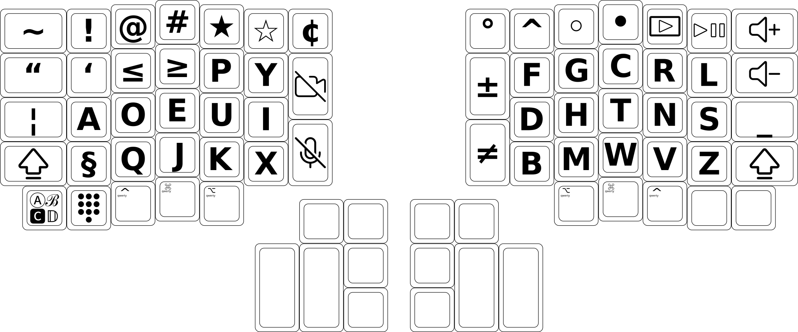
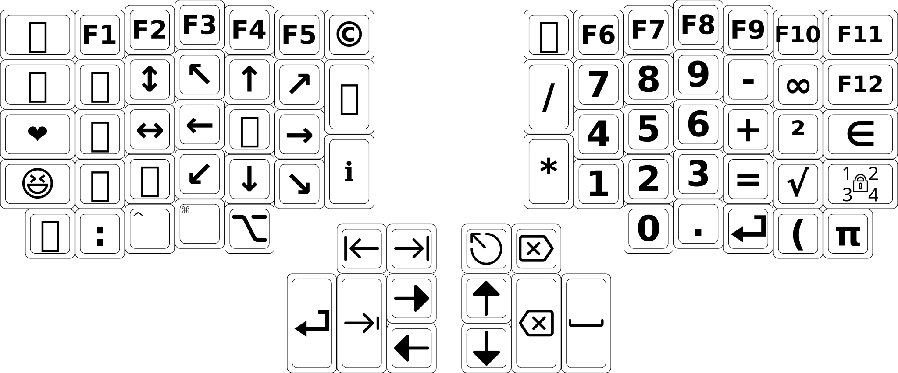
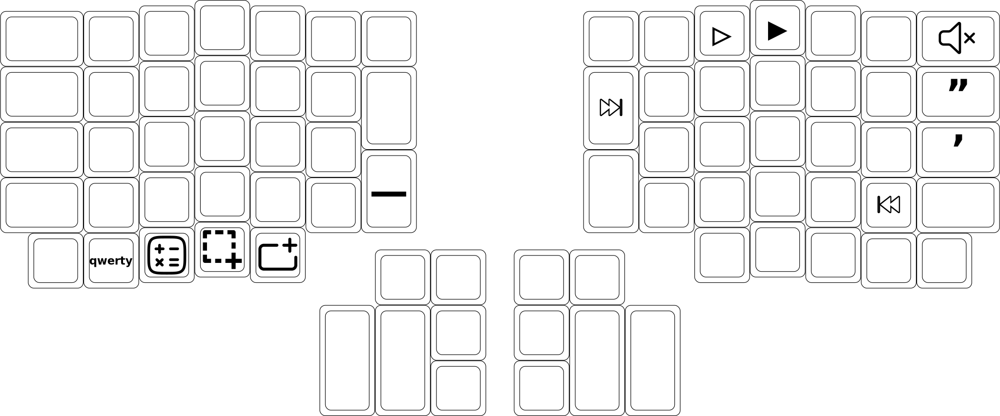
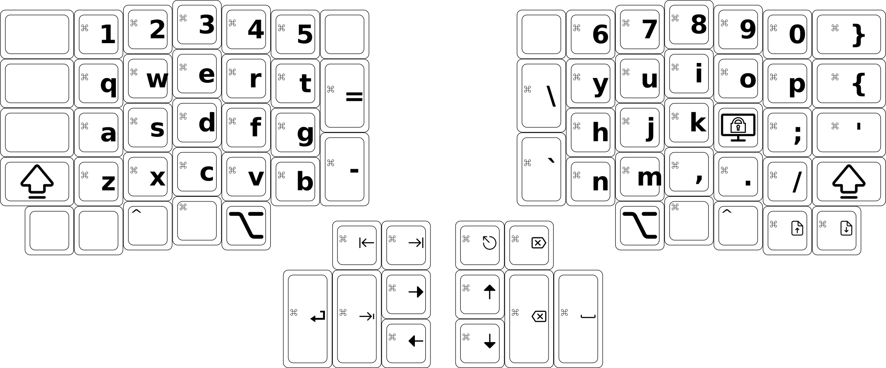

# Dvorak-Qwerty Layout for the ErgoDox EZ Keyboard

### [Download the firmware](https://github.com/stephenostermiller/qmk_userspace/releases/download/latest/ergodox_ez_base_dvorak_qwerty.hex)

## Features

### Dvorak-Qwerty

Dvorak layout for faster and more accurate typing. Switches to Qwerty layout when ctrl, meta, or alt are pressed so that cut, copy, and paste are easier to use.

### Space Cadet

Extended space cadet functionality where tapping the shift, ctrl, meta, and alt keys type paired symbols on the lift and right hands. Holding the key causes it to work as a modifier like usual.

### Auto shift

Holding keys types the shifted version of that key.

### Tap Dance

Many key have dual functions and produce different results when tapped, held, double tapped, or even triple tapped.

### Unicode and Emojis

Several keys type unicode symbols. How unicode characters are sent is auto-configured based on the OS of the computer into which the keyboard is plugged.

### Indicator Lights

During keyboard boot, the lights flash blue, green and red in turn.

When the keyboard detects it is connected to a new computer, the lights flash to indicate the detected computer OS:

- Green: Linux
- Red: Mac
- Red and Green: Windows

At other times the lights indicate the layout:

- No lights: Dvorak
- Green light: Qwerty
- Red light: Number keypad
- Blue light: CAPS lock, CAPS word, or arrow lock

### Media keys

Easy access to media keys in the main layout

## Layers

### Dvorak

### Dvorak (Hold)

### Dvorak (Shift)

### Dvorak (Double Tap)

### Dvorak (Double Hold)

### Dvorak (Triple Tap)

### Dvorak (Triple Hold)

### Num Fn

### Num Fn (Hold)

### Num Fn (Double Tap)

### Num Fn (Double Hold)

### Num Fn (Triple Tap)

### Num Fn (Triple Hold)

### Qwerty

### Qwerty (Hold)

### Qwerty (Shift)

### Qwerty (Double Tap)

### Qwerty (Double Hold)

### Qwerty (Triple Tap)

### Qwerty (Triple Hold)

### Qwerty Control

### Qwerty Meta

### Qwerty Alt

### Fancy

## Key Cap Labels

## Icons

###  Shift
License: MIT License, Author: Microsoft

###  Auto Shift
License: MIT License, Authors: Stephen Ostermiller, Microsoft

###  Caps Lock
License: MIT License, Authors: Stephen Ostermiller, Microsoft

###  Caps Word
License: MIT License, Authors: Stephen Ostermiller, Microsoft

###  Enter
License: MIT License, Author: Elusiveicons

###  Space
License: MIT License, Author: Microsoft

###  Tab
License: MIT License, Authors: Stephen Ostermiller, Microsoft

###  Backspace
License: MIT License, Author: Ionicons

###  Delete
License: MIT License, Authors: Stephen Ostermiller, Ionicons

###  Control
License: Public domain

###  Control Qwerty
License: Public domain

###  Meta
License: Public domain

###  Meta Qwerty
License: Public domain

###  Alt
License: Public domain

###  Alt Qwerty
License: Public domain

###  Escape
License: CC Attribution License, Author: Solar Icons

###  End
License: MIT License, Author: Microsoft

###  Home
License: MIT License, Authors: Stephen Ostermiller, Microsoft

###  Bottom
License: MIT License, Author: Microsoft

###  Top
License: MIT License, Authors: Stephen Ostermiller, Microsoft

###  Page Up
License: CC Attribution License, Author: Dazzle UI

###  Page Down
License: CC Attribution License, Author: Dazzle UI

###  Insert
License: Public domain

###  Calculator
License: CC Attribution License, Author: Solar Icons

###  File Manager
License: MIT License, Author: Microsoft

###  Mail
License: MIT License, Author: Microsoft

###  Full Screen
License: Apache License, Author: Richard9394

###  Screenshot
License: CC Attribution License, Author: Boxicons

###  Close Window
License: MIT License, Authors: Stephen Ostermiller, Microsoft

###  Lock Screen
License: MIT License, Authors: Stephen Ostermiller, Orchid

###  Num Lock
License: Public Domain

###  Media Player
License: MIT License, Authors: Stephen Ostermiller, Orchid, Vmware

###  Keypad
License: MIT License, Author: Ionicons

###  Fancy Alphabet
License: Public domain

###  Camera Off
License: CC Attribution License, Author: Dazzle UI

###  Mute Mic
License: MIT License, Author: Microsoft

###  Mute Speaker
License: MIT License, Author: Microsoft

###  Volume Up
License: MIT License, Authors: Stephen Ostermiller, Microsoft

###  Volume Down
License: MIT License, Authors: Stephen Ostermiller, Microsoft

###  Play Pause
License: MIT License, Authors: Stephen Ostermiller, Vmware

###  Fast Forward
License: MIT License, Authors: Stephen Ostermiller, Vmware

###  Rewind
License: MIT License, Authors: Stephen Ostermiller, Vmware

###  Next Track
License: MIT License, Authors: Stephen Ostermiller, Vmware

###  Previous Track
License: MIT License, Authors: Stephen Ostermiller, Vmware

###  Keyboard illustration
© 2019 ZSA Technology Labs, Inc.

